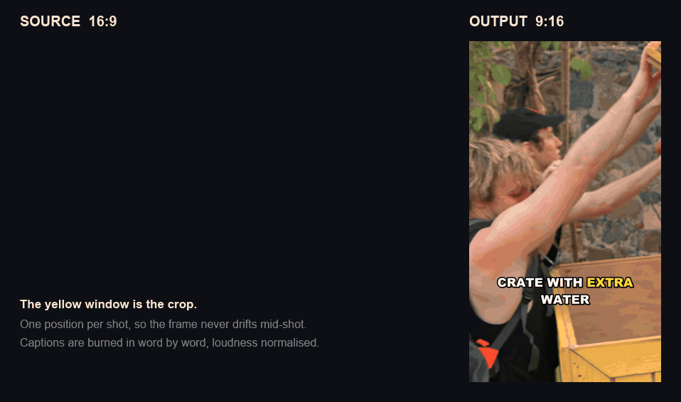

# Clipper

[](https://github.com/TypischSinan/generate-clips-for-tiktok-and-instagram/actions/workflows/ci.yml)

**A local, self-hosted alternative to OpusClip.** Drop in a YouTube link, get finished
vertical clips out — captions burned in, subject centered, ready to post.



```bash
clipper analyze "https://www.youtube.com/watch?v=..."   # or a local file path
clipper select <video-id> --from clips.json
clipper build <video-id>
```

Everything runs on your own machine: no upload, no subscription, no per-minute pricing.
A 20-minute source video yields 30+ standalone 9:16 clips, each with a hook overlay,
word-level captions and a ready-to-paste social caption.

Three things set it apart from most open-source clippers:

- **Keyframes go to the model as images**, not just the transcript — so it also works on
  action, gaming and challenge content, where the transcript says nothing about what is
  happening on screen.
- **No PyTorch.** Face detection uses YuNet from OpenCV (340 KB), transcription uses
  CTranslate2. The whole install stays small.
- **It works without any API key** — an included briefing format lets a Claude Code
  session do the moment selection instead.

---

## Contents

- [Why this exists](#why-this-exists)
- [Input](#input)
- [What the pipeline does](#what-the-pipeline-does)
- [Installation](#installation)
- [Two paths through the pipeline](#two-paths-through-the-pipeline)
- [Command reference](#command-reference)
- [Configuration](#configuration)
- [Design decisions](#design-decisions)
- [Maximizing clips per video](#maximizing-clips-per-video)
- [Captions](#captions)
- [Dead-air removal](#dead-air-removal)
- [Known limitations](#known-limitations)
- [Troubleshooting](#troubleshooting)
- [Tests](#tests)
- [Project layout](#project-layout)
- [Legal](#legal)

---

## Why this exists

Turning long-form video into short-form is a throughput problem: getting as many usable
clips as possible out of every source video without spending hours in an editor. The
hosted tools solve it, but they charge per minute of video and you upload your material
to someone else's server.

The open-source alternatives mostly pick moments from the transcript alone. That works
for podcasts and interviews, where what matters is what someone says. It falls apart on
anything visual — "oh my god" tells you nothing about whether a car just exploded or
someone opened a door. So this pipeline samples keyframes and sends them to the model as
images alongside the transcript, shot boundaries and an audio energy curve.

Typical uses:

- **Podcast and interview repurposing** — turn each episode into a batch of clips
- **Gaming, sports and reaction content** — where the payoff is visual, not spoken
- **Clipping campaigns** (Whop / Content Rewards, Vyro, clipping.net) — platforms that
  pay per 1,000 views for clips cut from a creator's released material. See
  [Legal](#legal) before using it that way.

---

## Input

Anything yt-dlp accepts, or a path to a file already on disk:

```bash
clipper analyze "https://www.youtube.com/watch?v=..."
clipper analyze ~/recordings/episode-14.mkv
```

A local file is used where it lies rather than copied — source videos run to
gigabytes and a second copy buys nothing. Only the derived artefacts go into
`work/`.

Sources without an audio track work too: screen recordings, silent B-roll,
music videos with the audio stripped. The transcript comes out empty, the
energy curve is skipped, and selection falls back to shot boundaries plus
keyframes. Rendering drops the audio stream instead of failing.

## What the pipeline does

| # | Stage | Tool | Output |
|---|-------|------|--------|
| 1 | Download | yt-dlp | `work/<id>/source.mp4` |
| 2 | Transcript | faster-whisper (CUDA) | Word-level timestamps |
| 3 | Shot detection | PySceneDetect | Cut boundaries |
| 4 | Audio energy | ffmpeg + numpy | Loudness envelope, peaks |
| 5 | Moment selection | Claude Opus 5 *or* a Claude Code session | Clips with hook, caption, score |
| 6 | Reframe | OpenCV / YuNet | 9:16 with subject tracking |
| 6b | Dead-air removal | transcript + energy curve | Speech pauses cut out |
| 7 | Captions | ASS | Word-by-word highlighting + hook |
| 8 | Render | ffmpeg | `out/<id>/NNN_score_title.mp4` |

Every stage caches its result in `work/<video_id>/`. A second run skips download,
transcription, shot detection and audio analysis, and starts straight at selection.
That matters, because you usually revise the selection several times.

**Output per video:**

```
out/<video-id>/
  001_088_Chicken_Named_Brian.mp4     # order_score_title
  002_085_He_Tried_To_Eat_It.mp4
  ...
  clips.json                          # hooks, captions, timestamps, scores
```

`clips.json` is what you need when uploading: for each clip the finished TikTok
caption including hashtags, the hook text, the source timestamps, and
`output_duration` — the length after dead-air removal, which is what the file
actually runs. It also records the render config the files were produced with, so
the next build can tell whether they still match what you asked for.

---

## Installation

### Requirements

| | Minimum | Recommended |
|---|---|---|
| Python | 3.12 | 3.12 (not 3.13+, due to CTranslate2 wheels) |
| ffmpeg | on PATH | 7.x or newer |
| GPU | none (CPU fallback) | NVIDIA with ≥6 GB VRAM |
| RAM | 8 GB | 16 GB+ |
| Disk | ~2 GB per hour of source video | |

ffmpeg on Windows:

```bash
winget install Gyan.FFmpeg
```

### Setup

```bash
git clone https://github.com/TypischSinan/generate-clips-for-tiktok-and-instagram.git
cd generate-clips-for-tiktok-and-instagram
uv sync --extra cuda
uv pip install -e .
```

Without an NVIDIA GPU, plain `uv sync` is enough; Whisper then runs on the CPU
(int8 — considerably slower, but functional).

The YuNet face detection model (~340 KB) downloads automatically into `models/` on
first run.

### Verify

```bash
clipper --help
python -m pytest tests/ -q
```

---

## Two paths through the pipeline

Moment selection (stage 5) is the only step that needs a language model. That's where
the pipeline is split.

### Path A — no API key, selection in a Claude Code session

The recommended path for personal use. No API costs, because selection happens inside
the running session.

```bash
clipper analyze "https://www.youtube.com/watch?v=..." --min 15 --max 40
```

This writes `work/<id>/brief.md` — a compact briefing with the timestamped transcript,
shot boundaries, the energy curve, and paths to the extracted keyframes. Claude Code
reads that file plus the images, picks the moments, and writes them as JSON:

```json
{"clips": [
  {"start": 360.5, "end": 383.0,
   "title": "Chicken Named Brian",
   "hook": "They waited 3 hours for this",
   "caption": "Three hours of waiting for one chicken 😭 #mrbeast #survival",
   "reason": "Complete arc with the punchline in the last sentence.",
   "score": 88}
]}
```

Then feed it back in and render:

```bash
clipper select <id> --from clips.json
clipper build <id>
```

`select` runs those proposals through **the same** post-processing as the API path:
shot boundaries, word boundaries, length correction, overlap resolution. Hand-picked
clips get exactly the same guarantees.

> A Claude Code session's credentials are **not** available to subprocesses — a script
> can't reuse them. Hence the split.

### Path B — with an API key, one shot

```bash
$env:ANTHROPIC_API_KEY = "sk-ant-..."
clipper run "https://www.youtube.com/watch?v=..."
```

Cost per video: the briefing is roughly 20–30k input tokens, plus 24 keyframes at
~750 tokens each. `--vision 0` runs selection without images (cheaper, nearly
equivalent for pure interview material, noticeably worse for action content).

### Path C — heuristic, for testing

Without a key, `run` automatically falls back to purely acoustic selection: windows
around the strongest energy peaks. This exists to exercise the pipeline, not to produce
real clips — the heuristic only knows loudness, so it produces neither meaningful
scores nor hooks.

---

## Command reference

### `clipper analyze <url>`

Stages 1–4 plus keyframes, writes the briefing. No API key needed.

| Option | Meaning |
|---|---|
| `--clips` / `-n` | Target clip count. `0` (default) = as many as possible |
| `--min` / `--max` | Clip length in seconds (default 60–90) |
| `--lang` | Force language, e.g. `en`, `de`. Otherwise auto-detected |
| `--whisper` | Whisper model: `tiny`…`large-v3` (default `large-v3`) |
| `--vision` | Number of keyframes for the briefing, `0` = none |
| `--aspect` | Output format: `9:16` (default), `4:5`, `1:1` |
| `--force` | Discard all caches and recompute |
| `-c` / `--config` | Layer your own YAML over the defaults |

### `clipper select <video-id> --from <file|->`

Takes clip proposals, cleans them up, writes `candidates.json`. `--from -` reads
stdin. Accepts `{"clips": [...]}` or a bare list.

Reports which clips were accepted and **which were dropped, with the reason** — when
you're maximizing yield, that's the actionable part.

Supports `--min`, `--max`, `--clips`, `-c`.

### `clipper build <video-id>`

Stages 6–8 from the stored selection.

| Option | Meaning |
|---|---|
| `--aspect` | Output format: `9:16` (default), `4:5`, `1:1` |
| `--no-captions` | Render without burned-in captions |
| `--no-silence` | Keep speech pauses instead of cutting them out |
| `--force` | Re-render clips that already exist |

Clips already on disk are reused — but only the ones that were rendered with the
same output settings. Change the aspect ratio, the captions, dead-air removal or
the encoder, and they are rebuilt without being asked. The filename carries index,
score and title and nothing about the format, so `clips.json` records a hash of the
render config; a build reads it back before trusting anything on disk.

### `clipper clean [video-id]`

Deletes cached working data and reports what it freed. Asks before deleting.

| Option | Meaning |
|---|---|
| `--outputs` | Also delete the rendered clips in `out/` |
| `--yes` / `-y` | Skip the confirmation |

By default only `work/` goes — source video, transcript, shots, energy curve,
keyframes. All of that is reproducible. The rendered clips are kept unless
`--outputs` is given, because they are the actual result.

### `clipper run <url>`

Everything in one go. In addition to the `analyze` options:

| Option | Meaning |
|---|---|
| `--no-llm` | Heuristic selection instead of Claude |
| `--no-captions` | No burned-in captions |
| `--no-silence` | Keep speech pauses instead of cutting them out |
| `--aspect` | Output format: `9:16` (default), `4:5`, `1:1` |
| `--reselect` | Recompute only the selection, keep the rest of the cache |

### `clipper list [video-id]`

Shows generated clips with score, hook and finished caption. Without an argument, all
videos.

---

## Configuration

`config/default.yaml` holds every parameter with comments. Override with
`--config mine.yaml` — the file is layered over the defaults, so you only specify
what differs.

### `ingest`

| Key | Default | Meaning |
|---|---|---|
| `max_height` | `1080` | Higher resolution = more cropping headroom |
| `download_sections` | `null` | Sub-range, e.g. `"*120-360"` or `"2:00-6:00"` |

### `transcribe`

| Key | Default | Meaning |
|---|---|---|
| `model` | `large-v3` | `tiny`…`large-v3`, `distil-large-v3` |
| `device` | `auto` | `auto` \| `cuda` \| `cpu` |
| `compute_type` | `auto` | `float16` on CUDA, `int8` on CPU |
| `language` | `null` | `null` = auto-detect |
| `vad_filter` | `true` | Trims silence, prevents hallucinations |

### `scenes`

| Key | Default | Meaning |
|---|---|---|
| `threshold` | `27.0` | Lower = more cuts detected |
| `min_scene_len` | `0.4` | Seconds |

### `select`

| Key | Default | Meaning |
|---|---|---|
| `clips` | `0` | `0` = unlimited, otherwise a hard cap |
| `min_score` | `45` | Floor; with unlimited clips this is the only quality brake |
| `min_duration` / `max_duration` | `60` / `90` | Seconds. Hard bounds - see below |
| `model` | `claude-opus-5` | Path B only |
| `effort` | `high` | Path B only |
| `vision_frames` | `24` | Keyframes sent to the model, `0` = off |
| `output_language` | `en` | Language of title, hook, caption |

`min_duration` and `max_duration` are hard bounds. A moment that cannot be
placed inside the range - because no shot boundary sits far enough out, which
happens at the tail of a video - is dropped rather than shipped short. Two
things used to leak past the range: the floor carried an 0.8 slack factor, and
the word-boundary correction ran after the length clamp, so it could push a
clip up to 0.8s over the ceiling. Both are closed, so the range you configure
is the range you get.

### `reframe`

| Key | Default | Meaning |
|---|---|---|
| `target_width` / `target_height` | `1080` / `1920` | Output size, or use `--aspect` |
| `sample_fps` | `4.0` | Sampling rate for subject detection |
| `min_face_weight` | `0.001` | Minimum face size (area × score) |

The crop is always static within a shot. When no face clears `min_face_weight`, the
fallback chain is: motion centroid → previous shot's position → frame centre.

### `captions`

| Key | Default | Meaning |
|---|---|---|
| `enabled` | `true` | |
| `font` / `font_size` | `Arial Black` / `96` | |
| `max_words` | `4` | **Leading constraint:** words on screen at once |
| `max_chars_per_line` | `20` | Overflow guard only |
| `max_lines` | `2` | |
| `max_gap` | `0.6` | Speech pause that forces a new block |
| `margin_v` | `420` | Distance from the bottom edge |
| `highlight_color` | yellow | Active word |
| `pop` | `true` | Briefly scale up the active word |
| `uppercase` / `strip_punctuation` | `true` / `true` | |
| `hook.*` | | Separate block for the hook overlay |

### `silence`

| Key | Default | Meaning |
|---|---|---|
| `enabled` | `true` | Dead-air removal. `--no-silence` turns it off per run |
| `min_gap` | `0.6` | Shortest word gap that counts as a pause |
| `padding` | `0.12` | Kept on each side, so the cut misses the last syllable |
| `max_energy` | `0.35` | Loudness ceiling for a gap to count as empty |
| `min_removed` | `0.25` | Cuts shorter than this are not worth the jump |

See [Dead-air removal](#dead-air-removal) for what those numbers do.

### `render`

| Key | Default | Meaning |
|---|---|---|
| `workers` | `4` | Parallel renders |
| `encoder` | `auto` | `auto` tests NVENC **functionally**, else libx264 |
| `crf` | `20` | Interpreted as `-cq` under NVENC |
| `audio_rate` | `48000` | Output sample rate. Do not raise - see note below |
| `fps` | `30` | |
| `loudnorm` | `true` | To −14 LUFS, the TikTok standard |

`loudnorm` resamples to 192 kHz internally. `audio_rate` pins the output back to a rate the platforms actually expect - without it the AAC encoder clamps to its own 96 kHz maximum.

---

## Design decisions

The interesting parts, each with the measurement behind it.

### No PyTorch

YOLO would be the obvious choice for subject detection — it pulls in roughly 3 GB of
CUDA-enabled Torch. YuNet, which ships inside OpenCV, is used instead: a 340 KB model,
equivalent for faces. Whisper runs through CTranslate2, which also needs no Torch. The
whole install stays small.

### Keyframes go into selection as images

24 by default, picked 60% at audio peaks and 40% on an even grid. Pure peak selection
misses quiet setup moments; a pure grid misses the payoffs.

### Sequential decoding during reframing

The first version repositioned the decoder for every sampled frame
(`CAP_PROP_POS_MSEC`). Each of those seeks forces the decoder back to the previous
keyframe — measured at 0.6 s per frame, i.e. **50.2 s of analysis for a 20-second
clip**.

Now it seeks once to the clip start, then grabs frames sequentially (`grab`) and only
decodes at the sample points (`retrieve`). Measured **5.9 s instead of 50.2 s — a
factor of 8.5.**

### The crop stays static per shot

A crop that pans within a single shot looks restless on fast-cut material and costs
considerably more compute. A hard jump on a cut boundary isn't noticeable, because the
whole frame changes there anyway.

For scale: a 20-minute MrBeast video has 642 shots, median 1.63 s, with 17% under one
second.

The per-shot fallback chain: weighted face centroid → motion centroid → previous shot's
position → frame center.

### Minimum face size

Without a threshold, the crop once followed a person far in the background occupying
0.04% of the frame — the only detection in that shot. The crop slammed to the frame
edge and missed the actual scene.

Measured across 144 detections: real subjects sit at a median of 0.54% of frame area,
with the 10th percentile at 0.15%. The threshold `min_face_weight: 0.001` keeps 95% of
detections and filters exactly that kind of outlier.

### Functional encoder test

A compiled-in encoder doesn't mean a working one. NVENC fails at runtime when the
driver is older than the NVENC API ffmpeg was built against — which otherwise only
surfaces during rendering. So `pick_encoder` encodes a test frame and falls back to
libx264 on failure.

---

## Maximizing clips per video

`select.clips: 0` (the default) means: take everything that survives. The brake isn't a
count, it's `select.min_score`.

Colliding clips are no longer simply dropped. `_finalize` tries three placements before
giving up:

1. Start snapped backward to the preceding cut — best quality, but may run into the
   previous clip
2. Start snapped forward to the following cut
3. Fitted into the actual free gap between two already-placed clips

**Measured on a 20:44 video:** 27 of 34 proposals survived with step 1 alone,
**34 of 34** with all three. Result: 14.2 minutes of clip material, 68% of the source
video used, median clip length 25.6 s.

`clipper select` names the dropped clips and why.

---

## Captions

Karaoke style: the whole line stays on screen, the active word is colored and briefly
scaled up. Pure ASS tags — no additional render cost.

**`max_words` controls density** and is the leading constraint. Measured on one clip:

| Setting | Words per block | On-screen time |
|---|---|---|
| no word limit | 7 | 1.48 s |
| `max_words: 4` (default) | 4 | 0.76 s |
| `max_words: 3` | 3 | 0.60 s |

**Breaks on speech pauses:** a new block starts after `max_gap` seconds of silence.
Without that check, a line sits dead on screen through a long pause.

**Hook overlay:** the hook sits large in the upper third for the first few seconds, as
its own ASS style rather than a `drawtext` filter — which avoids escaping special
characters in the filtergraph. Overlong text is truncated at a word boundary with an
ellipsis, never mid-word.

> **Careful with `max_chars_per_line`:** the value has to match the font size. At 96 px
> in Arial Black, roughly 22 characters fit across 1080 px — more runs off both edges,
> and ASS won't wrap automatically because of `WrapStyle: 2`. Longer on-screen time
> comes from `max_lines` and `max_words`, not from wider lines.

Umlauts and special characters work (`FÜR`, `GRÖSSTE`, `ÄÖÜ`). With `uppercase: true`,
`ß` correctly becomes `SS`.

---

## Dead-air removal

Long-form pacing leaves gaps that short-form cannot afford: a speaker breathes, walks
across the set, waits for a reaction. The renderer cuts those out and closes the gap.
Turn it off with `--no-silence` or `silence.enabled: false`.

**Two signals have to agree.** A gap between two transcribed words, at least `min_gap`
long — and audio energy under `max_energy` across that gap.

The second condition is the one that carries the feature. On reaction and challenge
content most word gaps are not silent at all: music runs underneath, something
explodes, a crowd reacts. Cutting on the transcript alone would delete exactly the
moments the clip was picked for. Measured over 14 minutes of source, 160 gaps longer
than 0.6 s — only about 40% of them are actually quiet.

What the energy gate costs and buys, measured across 34 clips (848 s of material):

| `max_energy` | Removed | Cuts | Clips touched |
|---|---|---|---|
| 0.20 | 15.3 s (1.8%) | 20 | 13/34 |
| **0.35** (default) | **19.7 s (2.3%)** | **26** | **18/34** |
| 0.50 | 33.5 s (4.0%) | 34 | 23/34 |
| no gate at all | 68.1 s (8.0%) | 61 | 27/34 |

Turning the gate off nearly triples the yield — and every extra second comes out of a
gap that had sound in it. 2.3% is the honest number for material like this; a talking-head
podcast, where the pauses really are empty, gives up far more.

**Only gaps between words are touched, never the clip edges.** The start and end were
snapped onto shot boundaries deliberately ([The crop stays static per shot](#the-crop-stays-static-per-shot)
explains why boundaries matter), and trimming into them would quietly undo that.

### Every cut lands on a frame boundary

Video keeps whole frames, audio keeps whole sample blocks. If the two round a cut
differently, the error is a random walk that grows with the number of cuts — and it is
invisible until someone watches a long clip and the lips stop matching.

That is not hypothetical. Cutting the audio with a decoder-sized block (~21 ms) against
33 ms video frames, measured by cross-correlating the rendered audio against the exact
concatenation the plan asked for:

| Position in the clip | Offset |
|---|---|
| 2% | +0.00 ms |
| 20% | +33.33 ms |
| 40% | +33.33 ms |
| 60% | +66.67 ms |
| 80% | +100.00 ms |

Three things together fix it, and all three are needed:

1. **Cut points snap to the output frame grid**, including the clip tail — a shot
   boundary lands wherever it lands, almost never on a frame.
2. **`asetnsamples` pins audio to one block per video frame**, so both sides have the
   same grid to cut on.
3. **The select expression compares against half-frame positions.** The interval bounds
   sit exactly on frame positions and ffmpeg's `between` is inclusive at both ends, so
   comparing against them leaves it to floating point whether the edge frame survives —
   independently for video and audio. Half a frame away is a position no frame ever
   occupies, so each interval keeps exactly `(b - a) × fps` frames on both sides,
   whatever the arithmetic does.

Same measurement afterwards, on three real clips with 2 to 4 cuts each: a constant
±0.2 ms across the whole clip, correlation 0.999. Under a deliberately reckless setting
that forces 13 cuts into 90 seconds: 0.00 ms at every measurement point, and the audio
matches the plan to the sample.

Captions are remapped onto the compressed timeline before anything else runs, so the
`max_gap` block break correctly stops firing on a pause that is no longer there.

---

## Known limitations

**Wide establishing shots with a static, faceless subject.** For example a trap at the
left edge of the frame against empty sand. Neither face nor motion detection finds
that.

A texture-and-saturation peak was tested as a substitute and rejected: checked against
22 frames with detected faces, it landed a median of 0.43 frame-widths away and hit
within 0.15 in only 14% of cases. It simply doesn't correlate with the subject. A real
fix would need an object model (opencv-contrib saliency, or YOLO) and therefore a much
heavier install.

In practice this is usually a selection problem, not a crop problem: don't start a clip
on an establishing shot, start it on the action.

**Render time.** 34 clips (14 minutes of material) take about 10 minutes with
`workers: 4` on an i5-13600KF — without NVENC, i.e. libx264 on the CPU. A driver update
that enables NVENC is the single biggest lever here.

**Shot detection is decode-bound, and speeding it up costs accuracy.** Measured on
5 minutes of 720p source, on an otherwise idle machine:

| Variant | Time | Shots | Speed-up |
|---|---|---|---|
| full resolution | 152.4 s | 167 | 1.0× |
| `downscale=2` | 121.9 s | 163 | 1.3× |
| `downscale=4` | 181.0 s | 163 | 0.8× |
| `frame_skip=1` | 106.2 s | 178 | 1.5× |

Downscaling stops helping past a factor of 2 and then reverses — the detector's
per-frame maths is cheap next to decoding, so shrinking the frame removes work that
was never the bottleneck and adds slicing overhead. `frame_skip` is the faster of the
two but invents boundaries: 178 instead of 167, the worst one landing 2.8 s from the
real cut. Since clips snap to shot boundaries, that would start clips nearly three
seconds off the intended moment. Neither is worth taking.

**Still open:** Whisper batching (`BatchedInferencePipeline`, factor 3–4), prompt
caching for `--reselect`, length variants of the same moment as an A/B test.

---

## Troubleshooting

**`Library cublas64_12.dll is not found`**
The pip packages place their CUDA DLLs under `site-packages/nvidia/*/bin`, where
CTranslate2 doesn't look. `utils/cuda.py` registers those paths at startup — both via
`os.add_dll_directory` and via `PATH`, because CTranslate2 loads through
`LoadLibraryA`, which only searches `PATH`. If the error persists, re-run
`uv sync --extra cuda`.

**`Driver does not support the required nvenc API version`**
ffmpeg was built against a newer NVENC API than your driver provides. The pipeline
falls back to libx264 automatically. Update the NVIDIA driver for GPU encoding.

**`Unable to parse "original_size" option value`**
ffmpeg reads the colon in a Windows drive letter as an option separator. So ffmpeg runs
with `cwd` set to the ASS file's directory and receives only the filename. Should no
longer occur.

**`UnicodeEncodeError` from `clipper list`**
The Windows console runs on cp1252 and chokes on emoji in captions. `cli.py` switches
stdout to UTF-8 with `errors="replace"` at startup.

**Captions in the wrong font**
libass silently substitutes missing fonts. Check that `captions.font` is actually
installed.

**`download_sections` downloads the whole video**
Fixed. The yt-dlp CLI's asterisk syntax isn't understood by the Python API; it's now
resolved to `(start, end)` in seconds beforehand.

---

## Tests

```bash
uv sync --extra dev
python -m pytest -q
python -m ruff check src tests
```

65 tests, run on every push and pull request by the CI workflow. The focus is on cut boundaries and caption layout — that's where a bug only
shows up when you watch the result, not as an exception. These tests caught three real
bugs during development:

- Block capacity computed `max_chars × max_lines`, ignoring that greedily wrapped lines
  waste space at line ends
- `snap_end_within` could return an end past the last shot boundary in its fallback,
  producing clips beyond the end of the video
- Length correction destroyed the shot snapping computed just before it

A fourth was found by measurement rather than by a test, and now has one: reusing a
rendered clip went by filename alone, so `build --aspect 4:5` reported success and
handed back the 9:16 files from the previous run.

---

## Project layout

```
src/clipper/
  cli.py                 Command line (analyze, select, build, run, list)
  pipeline.py            Orchestration, caching, briefing, parallel rendering
  config.py              YAML loading and merging
  models.py              Pydantic models for every intermediate state
  stages/
    ingest.py            yt-dlp, section downloads
    transcribe.py        faster-whisper, CUDA resolution
    scenes.py            PySceneDetect, snapping logic
    audio.py             RMS envelope, peak detection
    vision.py            Keyframe picking and extraction
    select.py            Prompt, LLM call, heuristic, post-processing
    reframe.py           YuNet, motion centroid, crop planning
    silence.py           Dead-air detection, frame-grid snapping
    captions.py          ASS generation, block layout, hook overlay
    render.py            ffmpeg filtergraph and encoding
  utils/
    ffmpeg.py            ffprobe, encoder test, audio decoding
    cuda.py              CUDA DLL paths on Windows
    cache.py             JSON caching per stage
config/default.yaml      Every parameter, with comments
tests/test_pipeline.py   65 tests
work/<video-id>/         Cache: source, transcript, shots, energy, keyframes
out/<video-id>/          Finished clips + clips.json
```

---

## Legal

This pipeline downloads and processes third-party video material. Whether you may
publish the result depends entirely on whether someone granted you the rights to it —
for example through a clipping campaign that releases exactly that material.

Without such a release there is no legal basis for it. There is no fair-use equivalent
in German copyright law; the quotation right (§ 51 UrhG) is narrow and requires genuine
engagement with the source, which plain re-cutting does not meet.

Practical consequences:

- Use only the material the campaign brief releases — not a creator's catalogue at
  large
- Follow the requirements: watermarks, tagging, permitted platforms, theme-page rules
- Campaigns generally reserve the right to demand takedown at any time
- Music rights are a separate layer: a licensed video with an unlicensed sound can
  still be muted or blocked

This repository provides a tool. Responsibility for the rights to the processed
material is yours.

---

## License

MIT — see [LICENSE](LICENSE).
